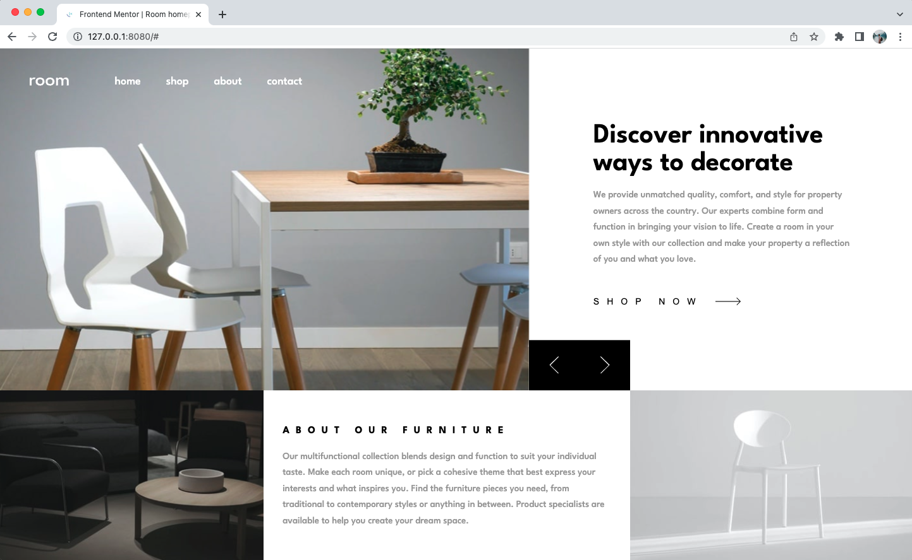

# Frontend Mentor - Room homepage solution

This is a solution to the [Room homepage challenge on Frontend Mentor](https://www.frontendmentor.io/challenges/room-homepage-BtdBY_ENq).

## Table of contents

- [Overview](#overview)
  - [The challenge](#the-challenge)
  - [Screenshot](#screenshot)
- [My process](#my-process)
  - [Built with](#built-with)
  - [What I learned](#what-i-learned)


## Overview

### The challenge

Users should be able to:

- View the optimal layout for the site depending on their device's screen size
- See hover states for all interactive elements on the page
- Navigate the slider using either their mouse/trackpad or keyboard

### Screenshot




## My process

### Built with

- Semantic HTML5 markup
- CSS custom properties
- Flexbox
- CSS Grid
- Mobile-first workflow
- LESS pre-processor
- 7-1 architecture, BEM naming
- Reusable classes
- Splide slider


### What I learned

1. Toggle class of an element by clicking a button.
2. Use Splide to create a fancy slider and customize it as design requires.
3. Create styling on Mobile-first basis.
4. LESS pre-processor used for development.
5. Listen to media query width through JS and customize look of navbar section.

To see how you can add code snippets, see below:


```js
addToggleClass = () => {
    const navbarToggler = document.getElementById("navbar__toggler");
    const navbarCollapse = document.getElementById("navbar__collapse");
    navbarToggler.classList.toggle("navbar__toggler--collapsed");
    navbarCollapse.classList.toggle("navbar__collapse--show");
}
```
```js
const mediaQuery = window.matchMedia('(min-width: 62.5em)')
function handleTabletChange(e) {
  // Check if the media query is true
  if (e.matches) {
    // Then log the following message to the console
    const navbarCollapse = document.getElementById("navbar__collapse");
    navbarCollapse.classList.add("navbar__collapse--show");
  } else {
    const navbarCollapse = document.getElementById("navbar__collapse");
    navbarCollapse.classList.remove("navbar__collapse--show");
  }
}
// Register event listener
mediaQuery.addEventListener('change', handleTabletChange)

// Initial check
handleTabletChange(mediaQuery)
```

